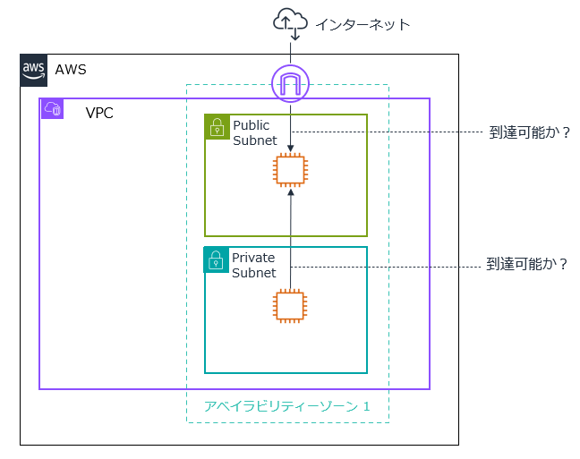

# VPC Reachability Analyzer でネットワークの到達性の問題を解決してみよう

* このワークでは、VPC Reachability Analyzer を使用して VPC リソースのネットワークの到達性の問題を特定します。

---
## 準備

* インストラクターが指定した環境で AWS マネジメントコンソールにサインインして下さい。
    - **このワークの環境は、ワークを実施する時間帯のみ使用可能です。**
    - **ワークに関連する操作のみ実施して下さいますようお願い致します。**
* AWS マネジメントコンソールで、**指定されたリージョン**を選択した状態にしてください。
* ご自分に割り当てられた **2桁の番号**を覚えておいてください。

---
## ワーク環境の作成

1. AWS マネジメントコンソールのページ上部の **検索**で `cfn` と入力して **CloudFormation** のメニューを選択します。
1. **スタックの作成**　から **新しいリソースを使用（標準）** を選択します。
1. **テンプレートの準備**　で **既存のテンプレートを選択** を選択します。
1. **テンプレートソース**　で **Amazon S3 URL** を選択します。
1. **Amazon S3 URL** に下記の URL を入力します。
    - `https://tnobep-work-public.s3.ap-northeast-1.amazonaws.com/vpc-ra-work/vpc-ra-work-template.yaml`
1. **次へ**　を選択します。
1. **スタック名** に `vpc-ra-stack-<自分の2桁の番号>` を入力します。
1. **パラメータ** の **YOURID** に **自分の2桁の番号** を入力します。 
1. **次へ**　を選択します。
1. ページを下にスクロールして、**AWS CloudFormation によって IAM リソースがカスタム名で作成される場合があることを承認します。** にチェックします。
1. **次へ**　を選択します。
1. **送信**　を選択します。
1. スタックのステータスが **CREATE_COMPLETE** になるまで待ちます。

---
## Reachability Analyzer を使用したパス分析:1

### インターネットゲートウェイから Public Subnet のインスタンスへの到達性の分析

1. AWS マネジメントコンソールのページ上部の **検索**で `network` と入力して **Network Manager** のメニューを選択します。
1. ページ左側で **モニタリングとトラブルシューティング** の **Reachability Analyzer** を選択します。
1. **パスの作成と分析** を選択します。
1. **名前** に `path1-<自分の2桁の番号>` を入力します。
1. **パスの送信元** で **送信元タイプ** に **Internet Gateways** を選択します。
1. **送信元** で **InternetGateway-<自分の2桁の番号>** を選択します。
1. **パスの送信先** で **送信元タイプ** に **Instances** を選択します。
1. **送信先** で **PublicInstance-<自分の2桁の番号>** を選択します。   
1. ページを下にスクロールして、**パスの作成と分析** を選択します。
1. **分析** セクションで **可達のステータス**　が **到達不可能** になるまで待ちます。
    - リフレッシュアイコンで表示を更新してください。
1. **分析エクスプローラー** セクションの内容を確認して、到達できない問題をシューティングしてください。
    - **分析** セクションで **分析を再実行** を行い **到達可能** になることを確認して下さい。
---
## Reachability Analyzer を使用したパス分析:2

### Private Subnet のインスタンスから Public Subnet のインスタンスへの到達性の分析

1. AWS マネジメントコンソールのページ上部の **検索**で `network` と入力して **Network Manager** のメニューを選択します。
1. ページ左側で **モニタリングとトラブルシューティング** の **Reachability Analyzer** を選択します。
1. **パスの作成と分析** を選択します。
1. **名前** に `path2-<自分の2桁の番号>` を入力します。
1. **パスの送信元** で **送信元タイプ** に **Instances** を選択します。
1. **送信元** で **PrivateInstance-<自分の2桁の番号>** を選択します。
1. **パスの送信先** で **送信元タイプ** に **Instances** を選択します。
1. **送信先** で **PublicInstance-<自分の2桁の番号>** を選択します。 
1. ページを下にスクロールして、**パスの作成と分析** を選択します。
1. **分析** セクションで **可達のステータス**　が **到達不可能** になるまで待ちます。
    - リフレッシュアイコンで表示を更新してください。
1. **分析エクスプローラー** セクションの内容を確認して、到達できない問題をシューティングしてください。
    - **分析** セクションで **分析を再実行** を行い **到達可能** になることを確認して下さい。
   
---

## パス分析の削除
1. AWS マネジメントコンソールのページ上部の **検索**で `network` と入力して **Network Manager** のメニューを選択します。
1. ページ左側で **モニタリングとトラブルシューティング** の **Reachability Analyzer** を選択します。
1. すべてのパス のチェックボックスをチェックします。
1. **アクション** - **パスの削除** を選択します。
1.  **パスを削除** を選択して削除を実行します。

---

## CloudFormation のスタックの削除
1. CloudFormation のページに切り替えます。
1. **vpc-ra-stack-<自分の2桁の番号>** のラジオボタンを選択します。
1. **削除** を選択して、確認ダイアログで **確認**　を選択します。
   
---
### お疲れさまでした。

* **このワークの環境は、ワークを実施する時間帯のみ使用可能です。**

